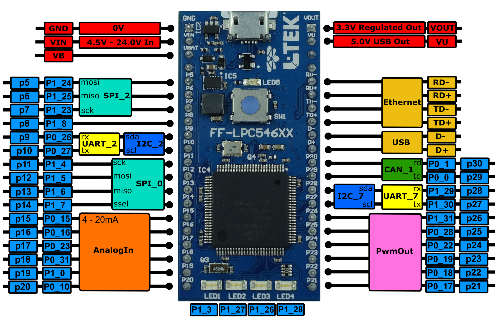

# L-Tek FF-LPC546XX

The L-Tek FF-LPC546XX is a small, 40-pin development board intended for prototyping general microcontroller applications. It is based on a low power, peripheral rich and debug capable NXP LPC54606 microcontroller, enhanced with power efficient 220 MHz ARM® Cortex®-M4 core, with integrated DAPLink interface for complete debugging experience. For more information visit [L-Tek Website](https://l-tek.si/web-shop/l-tek-ff-lpc546xx/).

This repo contains:

* [Board Support Pack](CMISIS-PACK/REPO/) for L-Tek FF-LPC546XX for uVision IDE. 

* [User Manual](docs/user_manual.md)

* FF-LPC546XX Pinout

   
   
   

