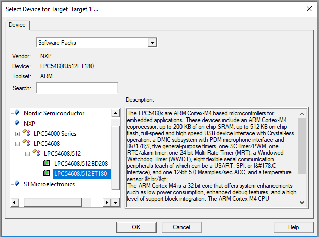
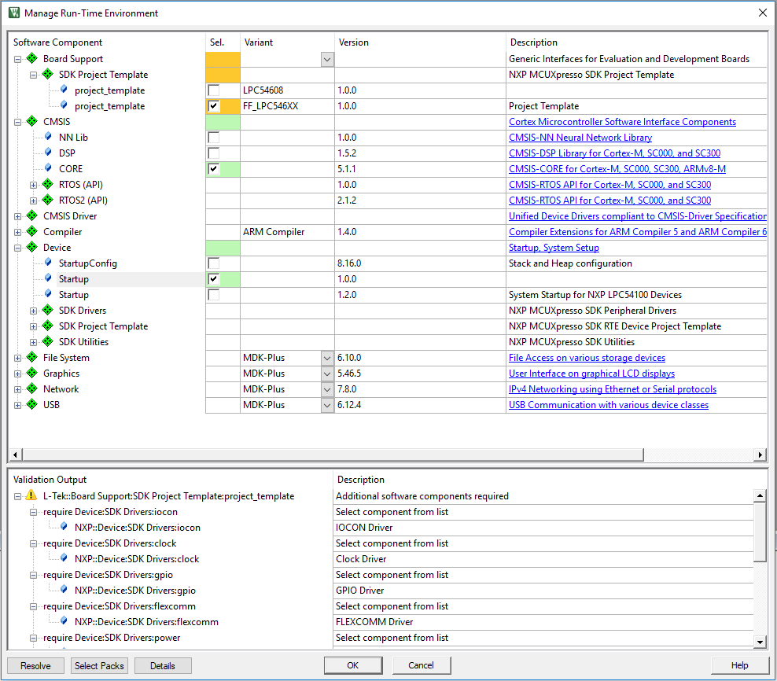
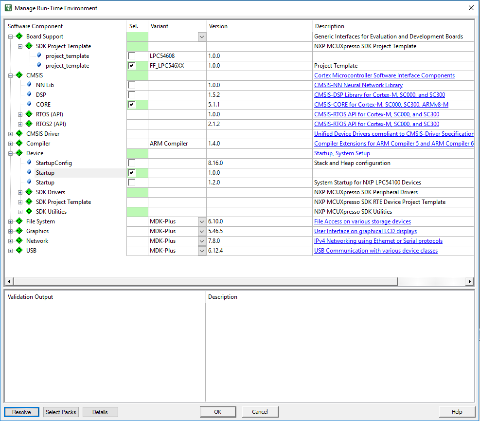
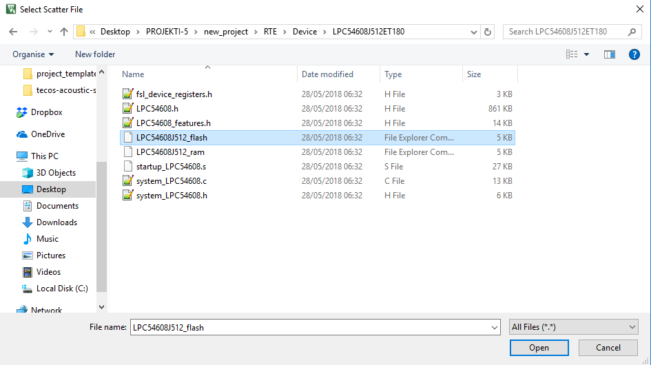
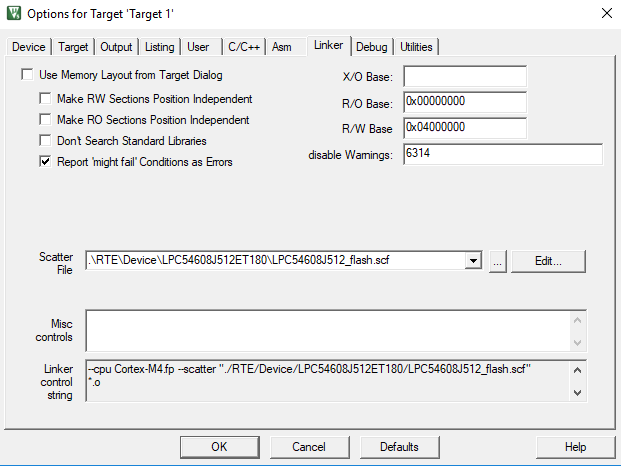
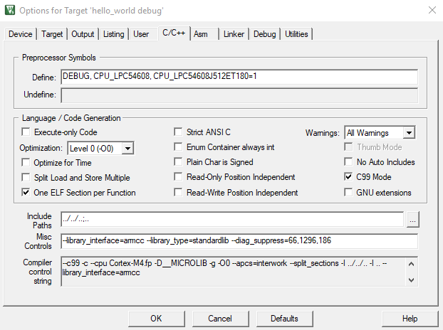
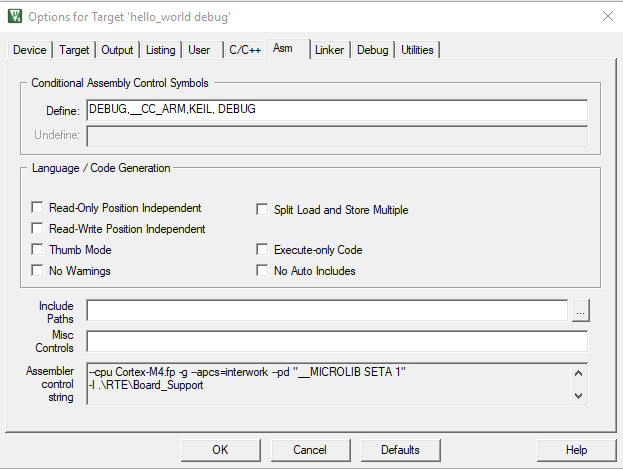
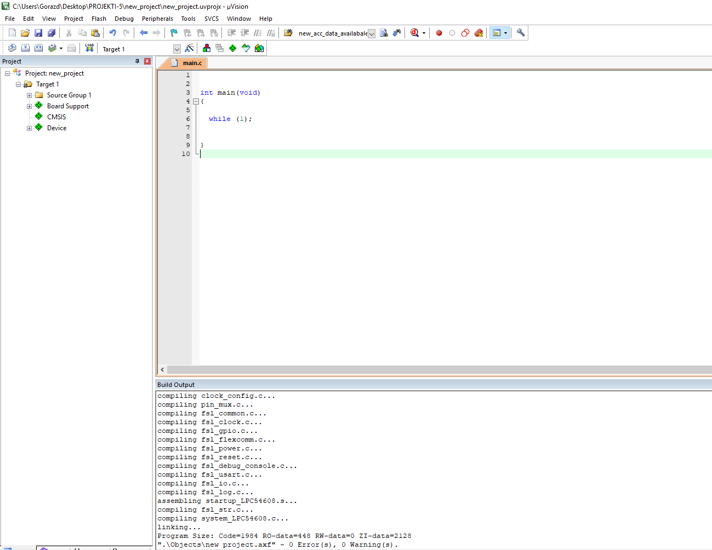
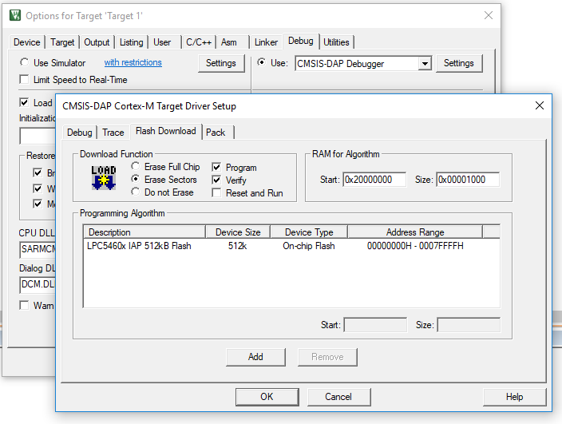

## User Guide

This document describes how to create a new project for **L-Tek FF-LPC546XX** in uVision IDE.

* **Select device.**

   

* **In run-time environment select the following components.**

   

* **Click resolve.**

   
    
 
* **Add scf file.**

  
  
  
  
* **Select the following options.**

  

  
  
* **Create main file and build.**

  
  
* **When flashing make sure to choose the correct flashing algorithm.**

  
