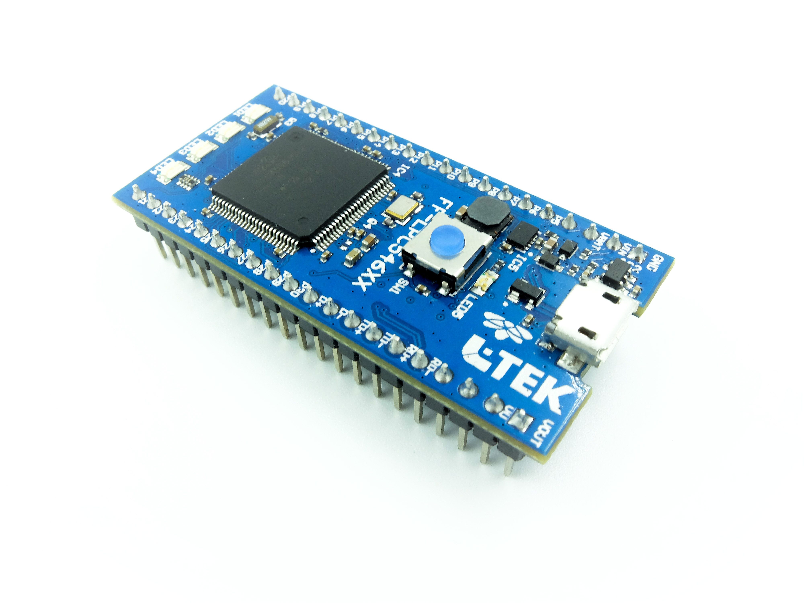

# FF-LPC546XX - User Guide

## Content

- [Abstract](#abstract)
- [Getting Started](#getting-started)
- [Creating a New Project](#creating-a-new-project)
- [Running Examples](#running-examples)
- [Conclusion](#conclusion)

### Abstract

This document describes how to create and run examples on **L-Tek FF-LPC546XX** board in uVision IDE.

### Getting Started

You need:

* uVision IDE 5
* L-Tek FF-LPC546XX board
* USB micro cable

### Creating a New Project

* **In uVison IDE create a new project and select device.**

   

* **In run-time environment select the following components.**

   

* **Click resolve.**

   
    
 
* **Add scf file.**

  
  
  
  
* **Select the following options.**

  

  
  
* **Create main file and build.**

  

  
* **When flashing make sure to choose the correct flashing algorithm.**  

  
  

### Running Examples

* **You can also run examples with pre-set project settings which can be found in *pack installer*.** 

  
  
* **You can find example specific documentation in the *Project* window.**

  

### Conclusion

Now you are ready to try some other examples or go right to developing your own applications.

